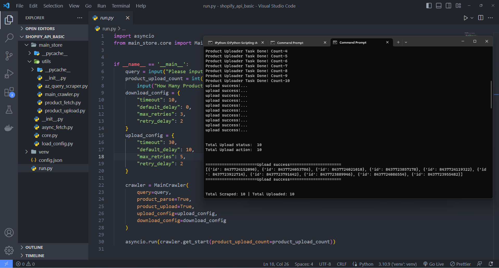
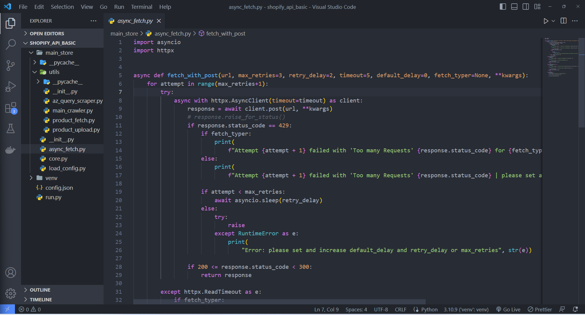

# Async Python Crawler to Upload Products into Shopify Store

\*\*Notes: This repository contains paid code. To access the full source code, please contact us.

## Overview

This Python script offers a powerful solution for automation the process of Amazon product data and seamlessly uploading it to the Shopify API.

- Asynchronous crawling for optimal performance.
- Real-time logs for monitoring the operations in the terminal.
- Smooth integration with the Shopify API for effortless product uploads.

## Video Demo

Watch a brief video [Watch the video](https://www.youtube.com/watch?v=VRyOiY5LCNQ)

## Screenshots

